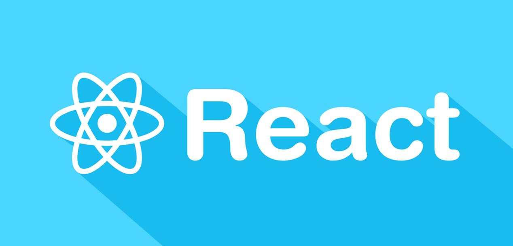
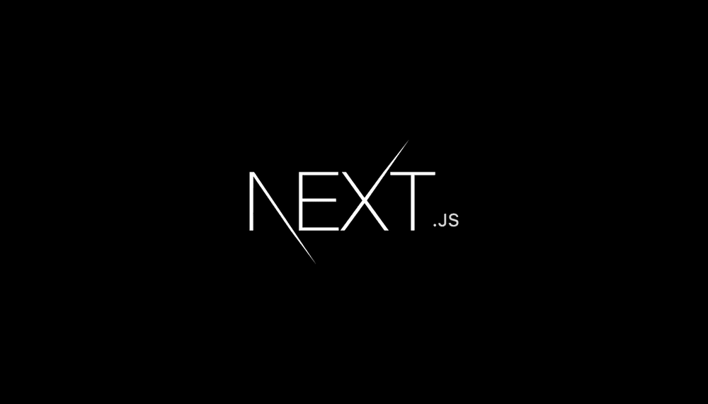

# DCCord

> - Este projeto foi idealizado na disciplina **DCC704 - Arquitetura e tecnologias de Sistemas Web** da Universidade Federal de Roraima **(UFRR)**
> - Trata-se de um ambiente de conversação em tempo real baseado em softwares já existentes como o WhatsApp e o Discord

---

## Tecnologias

### [ReactJs](https://pt-br.reactjs.org/)

 
  
  

### [Nextjs](https://nextjs.org/)

 
  
  

---

## Como executar o projeto

### **1. Instalar os pacotes:**

 

    npm install

### **2. Adicionar os arquivos com informações sensiveis**

#### .env

    // Caminho: /.env
    // arquivo com informação do banco de dados e a chave md5 utilizada na autenticação JWT

    DATABASE_URL="String-de-conexão-com-o-banco-de-dados-postgres"
    SECRET="chave-md5"

### **3. Gerar Client do prisma**

    npx prisma generate

### **4. Iniciar o servidor no modo de desenvolvimento**

    npm run dev
